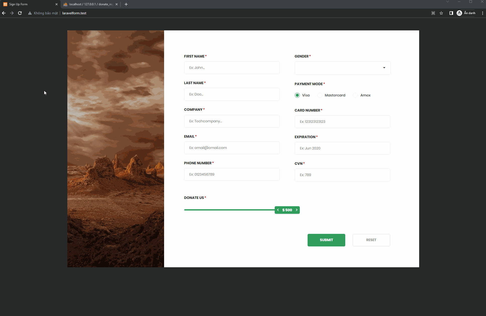
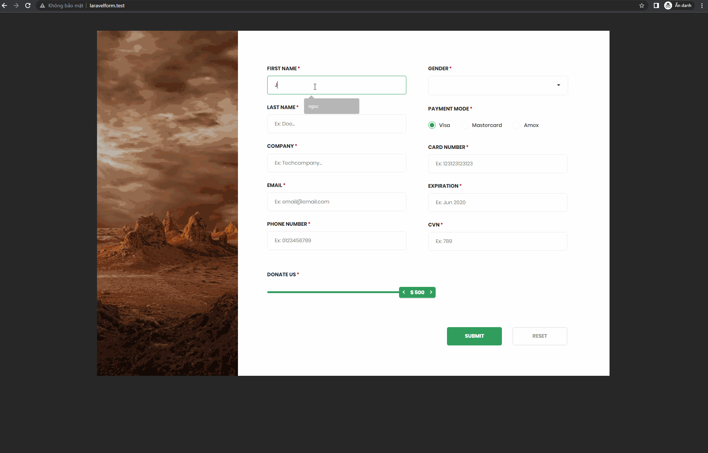
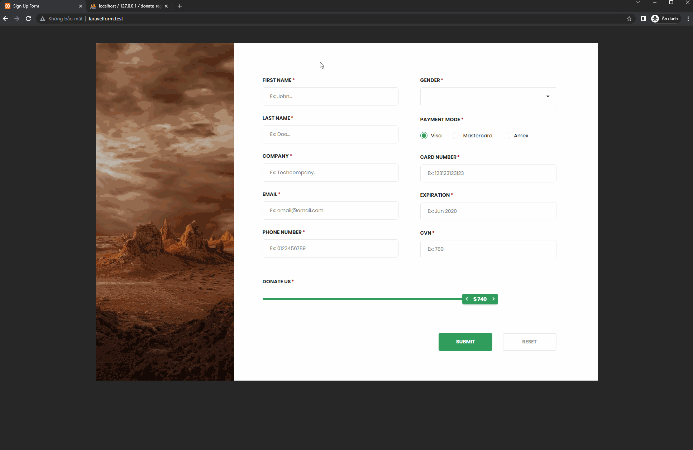
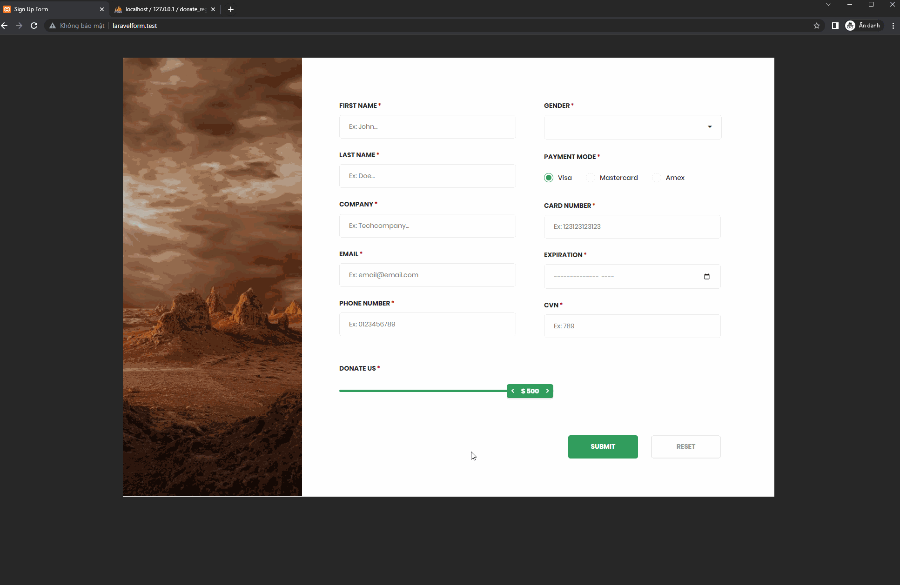
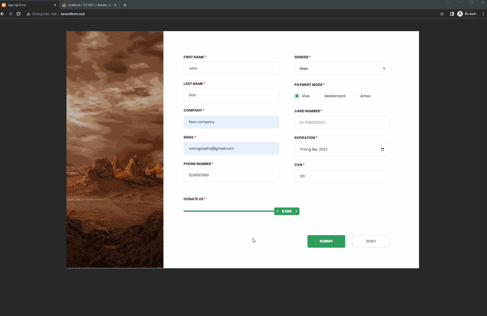

# Description
Project website: using laravel for creating this form website with purposing create new donation register
Update: 14:38 (GMT +7) 08/08/2023

# Index content
* [General info](#general-info)
* [Technologies](#technologies)
* [Feature](#feature)
* [Demo](#demo)
* [Update] (#update)

# General info
- This is from job's request
- Through to requirement, create a new logic for register new donation register with alot of fields for getting and storing data

# Technologies
- This project has been created based on Laravel Framework v9.52.12, PHP v8.2.4 from XAMPP
- Has using alpine.js for flash message
- MySQL is the database I'm using.

# Feature
- Register: User can register a new donation information with alot of fields for storing in database

# Demo
- Register Successfully:  
 
 
- Validate in Register:  

 
- Validate Gender fields:  

 
- Reset all fields value:  

# Update
- Add alot of logic for check validate data in client side.
- Because this project has css file inside, import boostrap css will make a conflict with css style => Error message just plain 
 tag
- Check all validate value:  

- Check valid for cardnumber:  

